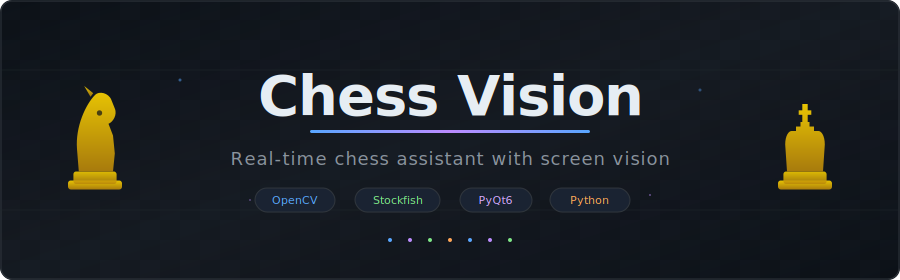
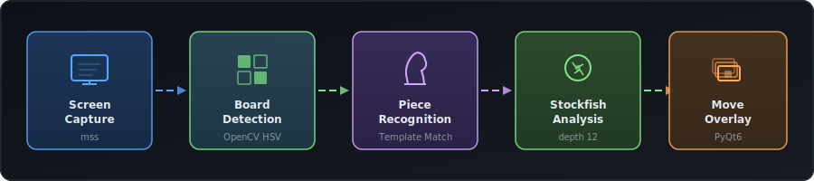

<p align="center">
  
</p>

<p align="center">
  <strong>Real-time chess move assistant that watches your screen, detects the board, recognizes pieces, and highlights the best move using Stockfish.</strong>
</p>

<p align="center">
  Built for chess.com — works as a transparent overlay on macOS that stays on top of everything and lets clicks pass through.
</p>

<p align="center">
  
  
  
  
</p>

---

## How It Works

<p align="center">
  
</p>

1. **Captures** your screen every 200ms
2. **Detects** the chess.com board by matching green/beige square colors in HSV space
3. **Recognizes** all pieces using template matching (light + dark square variants)
4. **Detects your color** automatically — your pieces are always on the bottom
5. **Analyzes** the position with Stockfish and finds the best move
6. **Highlights** the move on a transparent overlay pinned above all windows

The overlay is click-through — you interact with chess.com normally underneath it.

---

## Features

<p align="center">
  
</p>

---

## Requirements

- **macOS** (uses native Cocoa APIs for the overlay)
- **Python 3.10+**
- **Stockfish** engine installed

## Installation

### 1. Install Stockfish

```bash
brew install stockfish
```

### 2. Clone and install dependencies

```bash
git clone https://github.com/Kryskata-C/chessbot.git
cd chessbot
pip install -r requirements.txt
```

### 3. Grant screen recording permission

Go to **System Settings → Privacy & Security → Screen Recording** and enable your terminal app (Terminal, iTerm2, etc).

---

## Usage

### First time — Calibrate

Open chess.com in your browser with a game at the **starting position** (standard green/beige theme), then run:

```bash
python3 calibrate.py
```

This extracts piece templates from the visible board. Templates are saved to `templates/` and only need to be captured once per display/theme.

> **Tip:** If you skip this step, the app will try to auto-calibrate when it first sees a starting position.

### Run the assistant

```bash
python3 main.py
```

You'll see a status banner at the top of your screen:

| Status | Meaning |
|---|---|
| **"Playing as White"** | Detected your color |
| **"Best move: e2e4"** | Your turn — move highlighted |
| **"Opponent's turn"** | Waiting for opponent |
| **"Scanning... no board found"** | No chess.com board visible |

### Controls

| Key | Action |
|---|---|
| `Ctrl+Q` | Quit |
| `Ctrl+C` | Quit (in terminal) |

---

## Project Structure

```
chessbot/
├── main.py              # Main app — scan loop, game logic, status display
├── capture.py           # Screen capture using mss
├── board_detector.py    # Finds chess.com board via HSV color matching
├── piece_recognizer.py  # Template matching to identify pieces
├── engine.py            # Stockfish integration
├── overlay.py           # PyQt6 transparent always-on-top overlay
├── calibrate.py         # Interactive template extraction tool
├── recalibrate.py       # Quick non-interactive recalibration
├── requirements.txt     # Python dependencies
└── templates/           # Piece template images (generated by calibrate)
```

---

## Configuration

Edit the constants at the top of `main.py`:

```python
SCAN_INTERVAL_MS = 200   # How often to scan (ms)
```

Edit `engine.py` constructor for Stockfish settings:

```python
ChessEngine(depth=12, threads=2)  # depth 12 ≈ 2800+ ELO, responds in ms
```

| Depth | Approx. ELO | Speed |
|---|---|---|
| 8 | ~2200 | Instant |
| 12 | ~2800 | ~50ms |
| 18 | ~3200 | ~2-5s |
| 22 | ~3400 | ~30s+ |

---

## How the Overlay Works

The overlay uses native macOS Cocoa APIs via `ctypes` to:

- **Pin above all windows** — `NSScreenSaverWindowLevel` (level 1000)
- **Pass through all clicks** — `setIgnoresMouseEvents:YES`
- **Show on all desktops** — `setCollectionBehavior` with `canJoinAllSpaces`

No focus stealing, no cursor grabbing — completely invisible to interaction.

---

## Troubleshooting

**"No board found"**
- Make sure the chess.com board is fully visible on your primary monitor
- Use the default green/beige theme (the detector looks for those specific colors)
- Check that screen recording permission is granted

**Poor piece recognition**
- Re-run `python3 calibrate.py` with the starting position visible
- Make sure no popups or overlays are covering the board during calibration
- Each template needs both light and dark square variants — `recalibrate.py` handles this

**Wrong color detected**
- The app detects your color once on first scan based on which pieces are on the bottom
- Restart the app if you switch colors between games

---

## Roadmap

Planned features for future versions:

- **Full GUI menu** — Settings panel to configure engine depth, scan speed, overlay colors, and keybinds without touching code
- **Opponent analysis** — Track opponent's patterns, opening preferences, blunder tendencies, and time management across games
- **Human-like play mode** — A realistic bot that mimics human behavior:
  - Adjusts strength to match the opponent's rating
  - Wins by small margins instead of crushing — makes it look natural
  - Can stage convincing losses (miss a tactic, blunder in time pressure)
  - Varies move timing to simulate human thinking patterns
  - Avoids engine-like moves that look suspicious (e.g. deep sacrifices a human wouldn't find)
- **Adaptive strategy** — Dynamically adjusts playstyle based on the opponent:
  - Plays more aggressively against passive opponents
  - Simplifies positions against tactical players
  - Targets weaknesses detected from opponent analysis
- **Multi-platform support** — Windows and Linux overlay implementations
- **Opening book integration** — Use popular openings instead of engine moves in the first 10-15 moves for more natural play

---

## Tech Stack

- **[mss](https://github.com/BoboTiG/python-mss)** — Fast cross-platform screen capture
- **[OpenCV](https://opencv.org/)** — Board detection and template matching
- **[python-chess](https://python-chess.readthedocs.io/)** — FEN validation
- **[Stockfish](https://stockfishchess.org/)** — Chess engine via [stockfish Python package](https://pypi.org/project/stockfish/)
- **[PyQt6](https://www.riverbankcomputing.com/software/pyqt/)** — Transparent overlay window

---

## License

MIT
